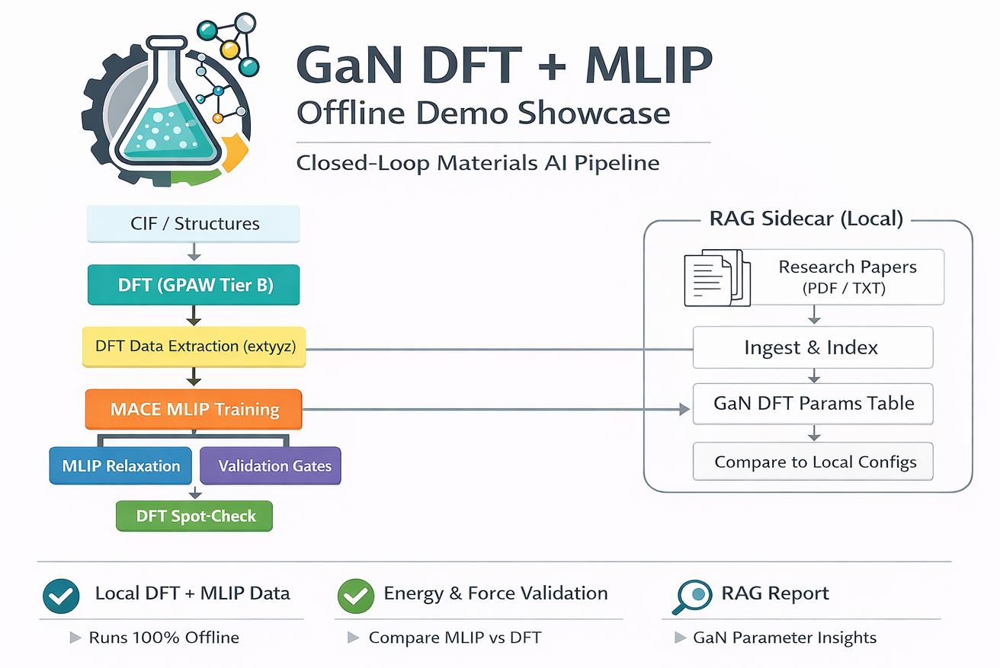

# A Machine Learning Pipeline for Semiconductor Materials Modeling (GaN Case Study)

Offline-first, reproducible codebase for a practical workflow:

`Crystal structure -> DFT reference labeling -> dataset extraction -> ML potential training -> large-cell relaxation -> quality checks`

This repository focuses on **code, scripts, and configuration**. Heavy results and local artifacts are intentionally excluded from version control.



## What This Project Demonstrates
- A clean end-to-end workflow from physics-based reference calculations (DFT) to fast ML-driven structure exploration.
- A production-style project layout with reproducible CLI entry points.
- Offline Streamlit demo pages for pipeline status, quality checks, relaxation demo, RAG summary, and STEM showcase.
- Practical guardrails: validation gates before using the ML model on larger systems.

## Why This Matters
- DFT is accurate but expensive for large cells.
- ML potentials are fast but must be checked against reference calculations.
- Combining both enables scalable, credible materials modeling for semiconductor defect studies.

## Related Article
For a higher-level overview of the project, see:

[From DFT to MLIP: A Lightweight Materials Modelling Pipeline for Semiconductor Metrology](https://medium.com/@alibaghizade/from-dft-to-mlip-a-lightweight-materials-modelling-pipeline-for-semiconductor-metrology-a6a6958674a3)

## Repository Structure
```text
.
|-- app/                     # Streamlit demo application
|   |-- main.py
|   |-- pages/
|   `-- demo_data/plots/     # static images used in README/app
|-- analysis/
|   `-- scripts/             # quality checks, STEM helpers, analysis
|-- configs/                 # YAML configs for training/gates/DFT settings
|-- dft/
|   |-- scripts/             # DFT labeling / structure utilities
|   `-- structures/          # input CIF structures
|-- mlip/
|   `-- scripts/             # ML potential training/AL scripts
|-- rag/                     # local RAG ingest/report components
|-- scripts/                 # artifact freezing / cards generation
|-- tests/                   # smoke tests
|-- run_pipeline.py          # pipeline orchestration entry point
|-- Makefile
`-- environment.yml
```

## Quick Start
```bash
conda env create -f environment.yml
conda activate mlip_env
make demo
```

## Core Commands
```bash
# DFT labeling (reference data)
dft/scripts/tier_b_calculations.py --gpu --calc-type single_point --structure-ids GaN_bulk_sc_2x2x2 --max-structures 1 --maxiter 25 --conv-energy 1e-3 --conv-density 1e-2 --conv-eigenstates 1e-4 --mag-config none

# Build ML dataset from completed DFT results
dft/scripts/extract_dft_data.py --max-atoms 300

# Train ML potential
mlip/scripts/train_mlip.py --max-epochs 80 --patience 10 --eval-interval 20 --energy-weight 10.0 --forces-weight 10.0

# Gate checks
analysis/scripts/energy_gate.py --model path/to/model.model --dft-json dft/results/tier_b_results.json --device cuda --threshold 0.01 --case GaN_bulk_sc_4x4x4_relaxed:dft/structures/GaN_bulk_sc_4x4x4_relaxed.cif
analysis/scripts/force_gate.py --model path/to/model.model --structure-id GaN_vacancy_line_N_sc_4x4x4_relaxed --cif dft/structures/GaN_vacancy_line_N_sc_4x4x4_relaxed.cif --source sr --use-dft-geometry --select coord --coord-rcut 2.4 --coord-max 3 --mae-thresh 0.25 --max-thresh 1.0
```

## Reproducibility and Data Policy
- Computed outputs are not versioned (e.g., `dft/results/`, `mlip/results/`, `analysis/results/`).
- Keep this repository code-centric; regenerate artifacts on your own compute resources.
- Use `make demo-artifacts` when you want to refresh local demo bundles.

## Streamlit Demo
```bash
make demo
```
Open the shown local URL to explore pipeline status, quality checks, ML relaxation demo, RAG assistant, and STEM outputs.

## License
This project is licensed under the MIT License. See [`LICENSE`](LICENSE).
